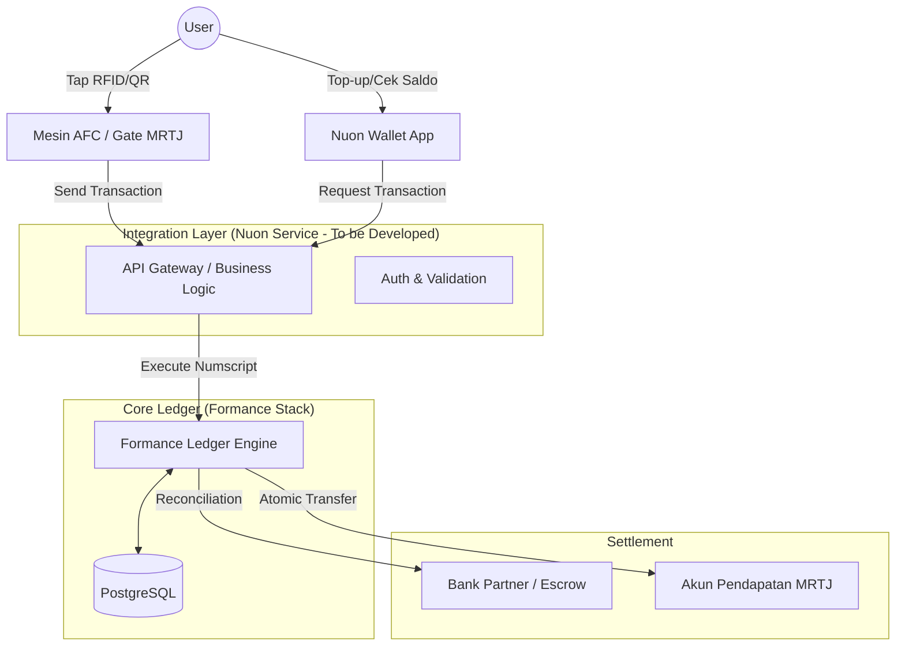

# Arsitektur Integrasi Formance Ledger - MRTJ (Nuon Ecosystem)

## 🏗️ Posisi Formance Ledger dalam Sistem MRTJ
Formance Ledger bertindak sebagai **Source of Truth (Pusat Kebenaran)** untuk semua pergerakan dana di ekosistem MRTJ. Ia tidak menggantikan mesin AFC atau App Wallet, melainkan menjadi "mesin akuntansi" di belakangnya.

### 🧩 Diagram Arsitektur (Mermaid)

## 🛠️ Apa yang Harus Kita Develop?
1.  **Middleware Integration Service:** Layanan (Go/Python) yang menerima data dari mesin AFC dan menerjemahkannya menjadi perintah *posting* ke Formance Ledger.
2.  **Numscript Engine:** Skrip untuk logika pembagian pendapatan (misal: pembagian antara operator sarana dan prasarana).
3.  **Settlement Worker:** Sistem otomatis untuk memindahkan dana dari akun penampung ke akun bank mitra setiap akhir hari.

## 🛡️ Mengapa Formance Ledger?
Formance Ledger adalah standar industri untuk sistem keuangan modern.
- **Battle-Tested:** Digunakan oleh berbagai platform fintech dunia untuk mengelola jutaan transaksi.
- **Pendanaan Kuat:** Baru saja mendapatkan pendanaan **Seri A sebesar $21 Juta** pada tahun 2025.
- **Bukti Pendanaan:** [Formance Secures $21M Series A for Ledger-as-a-Service Platform](https://www.formance.com/blog/formance-series-a-funding)

---
*Dokumen ini diperbarui berdasarkan RFI Sistem Manajemen Kredit/Pembayaran MRTJ.*
